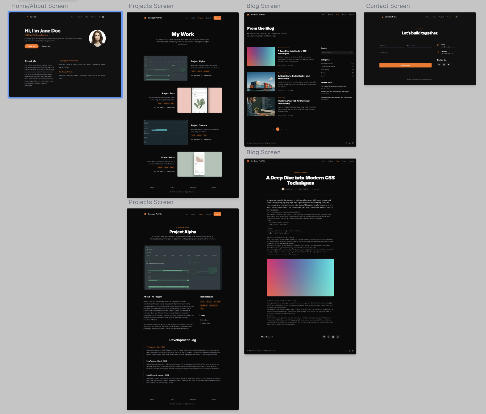

# Developer Blog Platform

A modern, static blog platform built with React, TypeScript, and Tailwind CSS. Write your content in Markdown and deploy anywhere.

## Preview



## Features

- 🚀 **Static Site**: No backend required - deploy to any static hosting
- 📝 **Markdown Content**: Write blog posts and project showcases in Markdown
- 🎨 **Modern UI**: Responsive design with Tailwind CSS
- ⚡ **Fast Performance**: Optimized static site with Vite
- 🔍 **SEO Friendly**: Proper meta tags and semantic HTML
- 🏷️ **Tag System**: Organize content with tags and categories
- 📱 **Mobile First**: Responsive design that works on all devices

## Tech Stack

- **Frontend**: React 18 + TypeScript + Tailwind CSS + Vite
- **Content**: Markdown with frontmatter support
- **Processing**: Remark + Gray Matter for content parsing
- **Testing**: Vitest + Testing Library
- **Deployment**: Static site (Vercel, Netlify, GitHub Pages, etc.)

## Project Structure

```
├── content/               # Markdown content
│   ├── articles/         # Blog posts
│   └── projects/         # Project showcases
├── packages/
│   └── frontend/         # React application
│       ├── src/
│       │   ├── components/  # Reusable UI components
│       │   ├── features/    # Feature-specific components
│       │   ├── lib/         # Content processing utilities
│       │   └── styles/      # Global styles
│       └── package.json
├── docs/                  # Documentation
├── docker-compose.yml     # Development environment
└── README.md
```

## Getting Started

### Prerequisites

- Node.js 18+
- pnpm (recommended) or npm

### Installation

```bash
# Clone the repository
git clone https://github.com/yourusername/developer-blog-platform.git
cd developer-blog-platform

# Install dependencies
pnpm install
```

### Development

```bash
# Start development server
pnpm dev

# The site will be available at http://localhost:5173
```

### Building

```bash
# Build for production
pnpm build

# Preview production build
pnpm preview
```

## Content Management

### Writing Blog Posts

Create new blog posts in `content/articles/` with the format `YYYY-MM-DD-title.md`:

```markdown
---
title: "Your Blog Post Title"
date: "2024-11-10"
author: "Your Name"
description: "Brief description of the post"
tags: ["tag1", "tag2", "tag3"]
published: true
---

# Your Blog Post

Your content here. Supports **bold**, *italic*, [links](https://example.com), and more.

## Code Blocks

```javascript
function hello() {
  console.log('Hello, World!')
}
```

## Lists

- Item 1
- Item 2
- Item 3
```

### Writing Project Showcases

Create project showcases in `content/projects/` with the format `project-name.md`:

```markdown
---
title: "Project Name"
date: "2024-11-05"
author: "Your Name"
description: "Brief project description"
tags: ["technology", "category"]
published: true
demo: "https://project-demo.com"
---

# Project Title

Project description, features, and details...
```

### Frontmatter Fields

- `title`: Post/project title
- `date`: Publication date (YYYY-MM-DD)
- `author`: Author name
- `description`: Brief description for previews
- `tags`: Array of tags for categorization
- `published`: Set to `false` to hide content
- `demo`: (Projects only) Link to live demo

## Development Workflow

1. **Write Content**: Create markdown files in the appropriate content directory
2. **Test Locally**: Run `pnpm dev` to preview changes
3. **Build & Test**: Run `pnpm build` and `pnpm test` to ensure everything works
4. **Deploy**: Push to your hosting platform

## Available Scripts

### Root Level
- `pnpm install` - Install all dependencies
- `pnpm dev` - Start development server
- `pnpm build` - Build all packages
- `pnpm preview` - Preview production build

### Frontend Package
- `pnpm dev` - Start Vite dev server
- `pnpm build` - Build for production
- `pnpm preview` - Preview production build
- `pnpm lint` - Lint code
- `pnpm type-check` - Type check
- `pnpm test` - Run tests
- `pnpm test:watch` - Run tests in watch mode

## Code Quality

```bash
# Lint code
pnpm lint

# Type checking
pnpm type-check

# Run tests
pnpm test
```

## Deployment

### Vercel (Recommended)

1. Connect your GitHub repository to Vercel
2. Vercel will automatically detect the Vite configuration
3. Set build command: `pnpm build`
4. Set output directory: `packages/frontend/dist`

### Netlify

1. Connect your repository to Netlify
2. Set build command: `pnpm build`
3. Set publish directory: `packages/frontend/dist`

### GitHub Pages

```bash
# Build the project
pnpm build

# Deploy to GitHub Pages (requires GitHub CLI)
gh-pages -d packages/frontend/dist
```

### Docker

```bash
# Build Docker image
docker build -t blog-platform packages/frontend

# Run container
docker run -p 5173:5173 blog-platform
```

## Customization

### Styling

The project uses Tailwind CSS for styling. Customize the design by:

1. Modifying `packages/frontend/src/styles/index.css`
2. Updating the Tailwind configuration in `packages/frontend/tailwind.config.js`
3. Adjusting component styles in the component files

### Content Structure

Feel free to modify the content directory structure and update the content processing utilities in `packages/frontend/src/lib/content.ts` to match your needs.

### Adding Features

The platform is built with modularity in mind. Add new features by:

1. Creating new components in `packages/frontend/src/components/`
2. Adding new pages in `packages/frontend/src/features/`
3. Updating the routing in `packages/frontend/src/App.tsx`

## Contributing

1. Fork the repository
2. Create a feature branch
3. Make your changes
4. Add tests for new functionality
5. Ensure all tests pass
6. Submit a pull request

## License

MIT